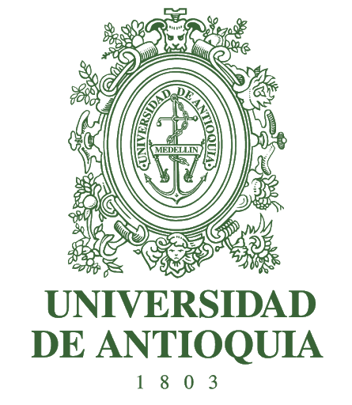

# RemoteLaboratories
This repository is create to share the information about the building of some remote laboratories made in the University of Antioquia

Author: Fabian Castaño

### Considerations

- Review the decimal point configuration in PC, it needs to be a dot

### Delphi comport installation

https://github.com/CWBudde/ComPort-Library
